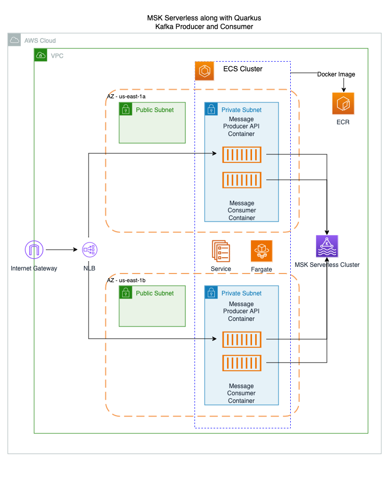

## serverless-kafka-with-quarkus

## Description
This repository demonstrates Serverless Message driven architecture using AWS MSK Serverless 
(Managed Streaming for Apache Kafka) and ECS Fargate to host Java microservices built with the Quarkus framework. 
This sample shows different configurations required to establish connectivity from Java application to AWS MSK Serverless.
AWS CDK written in TypeScript is used for infrastructure as code development. IAM authentication enables the 
Java Quarkus applications to access MSK. 

This repository has 3 modules infra, kafka-consumer, kafka-producer.

**infra** - This module has CDK project to deploy all AWS infrastructure, it also builds container images for
kafka-consumer and kafka-producer API apps and deploys it to ECS Fargate.

**kafka-consumer** - This folder has MSK Serverless consumer app developed using Java Quarkus framework. This
application is deployed as an ECS Fargate service to consumer kafka messages.

**kafka-producer** - This is message producer application developed in Java Quarkus. It is exposed as an API using NLB
to produce message in Kafka.

Producer and Consumer apps use IAM to access the MSK Serverless cluster.

## Target Architecture


## Product Versions
- AWS SDK For Java v2.20.153
- AWS CDK v2.133.0
- Amazon Corretto v21.0.2, distribution of Open JDK
- Java Quarkus Framework v3.2.2.Final (https://quarkus.io/)

## Prerequisite
- AWS Account with AWS Identity and Access Management (IAM) permissions to access AWS CloudFormation, AWS IAM and create
  necessary services.
- AWS CDK Toolkit
  If it is not already installed, install it using following commands.
    ```
    npm install -g aws-cdk@2.133.0
    ```
  If AWS CDK Toolkit version is earlier than 2.133.0, then enter the following command to update it to version 2.133.0.
    ```
    npm install -g aws-cdk@2.133.0 --force
    ```
- Docker desktop or Colima version 0.5.5

## Deployment
- Clone the repository on your local machine.
```
git clone <<repository url>>
```
- On Terminal window navigate to “infra” folder and run the following commands.
```
npm install
```
- Following step is required for the first time to bootstrap the CDK environment.
  This step is optional for the successive deployments.
```
npx cdk bootstrap aws://{your AWS Account Id}/{your AWS Region}
```
- Deploy the stack using following command. Following command also builds a docker image for consumer and producer app
  so, make sure Docker desktop is running on your machine.
```
npx cdk deploy
```

## Testing
Once the deployment is complete you should see sample URL for the kafka-producer API. This URL is also available in
AWS Console - Cloud Formations - InfraStack - Outputs tab. For testing purpose, we are using Kafka topic name "orders".
"kafka-producer" app checks whether topic exists or not and creates if it doesn't exist.
- Copy the URL with sample data and paste it in a browser window.
- "Success" message will appear on the screen which indicates that message is produced successfully in "orders" topic in
  kafka.
- Sample consumer application consumes the message and writes it to a CloudWatch log.
- Check the ECS Task log or CloudWatch log using AWS Console.

## Cleanup
Navigate to “infra” folder on terminal window and run the following command.
```
npx cdk destroy
```

## Additional Information
- Kafka bootstrap URL is provided to ECS Task (kafka-producer, kafka-consumer) using environment variable
  "KAFKA_BOOTSTRAP_SERVERS".
- Gradle is used for consumer and producer Java applications.
- kafka-producer and kafka-consumer applications settings are stored in application.properties file.
- Each Java application has Dockerfile.jvm file to define docker image configuration.
- By default, Kafka message is acknowledged on kafka-consumer method return. Different Acknowledgement strategies can be used as per the requirement.

## Security

See [CONTRIBUTING](CONTRIBUTING.md#security-issue-notifications) for more information.

## License

This library is licensed under the MIT-0 License. See the LICENSE file.

